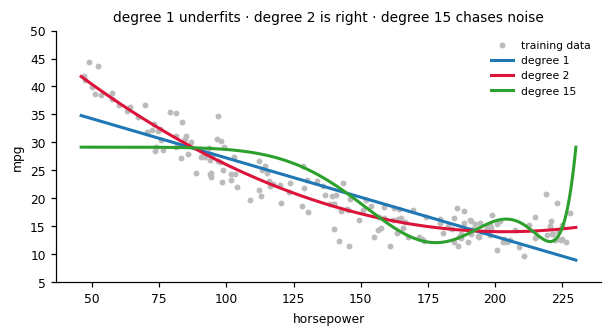
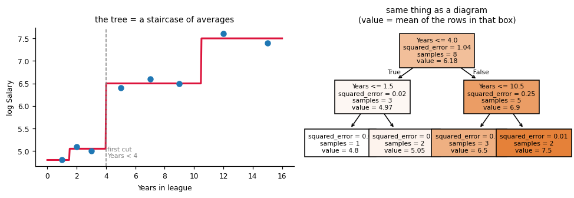
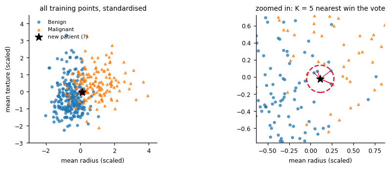

# DSB102 — The whole unit on one page

## The core idea

Machine learning is **predicting**. You assume `Y = f(X) + ε`

- `X` = inputs (features / predictors)
- `Y` = what you want to predict (response / target)
- `f` = the pattern — unknown, the model's job is to guess it
- `ε` = noise you can **never** remove (irreducible error)

| Type | Y is | Question |
|---|---|---|
| **Regression** | a number | *how much?* |
| **Classification** | a category | *which one?* |

Everything else is: **which model → how to check it → how to improve it.**

```python
# every snippet below assumes this
import numpy as np, pandas as pd
from sklearn.model_selection import train_test_split, cross_val_score, GridSearchCV
from sklearn.preprocessing import StandardScaler
from sklearn.pipeline import make_pipeline
X_train, X_test, y_train, y_test = train_test_split(X, y, test_size=0.2, random_state=42)
```

---

# PART 1 — REGRESSION

## Step 1: plot it, then pick the model


**Read the shape → read the model name.** That is the whole decision.

---

## 1. Straight line → **Linear regression (OLS)**

Minimises `RSS = Σ(y − ŷ)²`. Start here always.

**Example — Advertising data (n = 200), predict Sales from three budgets:**

|   TV  | Radio | Newspaper | Sales |
|------:|------:|----------:|------:|
| 151.8 |  27.9 |     108.0 |  10.1 |
| 281.4 |  19.2 |     109.6 |  19.0 |
|  43.3 |  39.3 |      73.8 |  11.9 |
| 280.8 |  30.0 |      32.0 |  19.1 |

Fitted model: `Sales = 3.385 + 0.0454·TV + 0.1857·Radio − 0.0095·Newspaper`

Predictions on 5 held-out rows:

|   TV  | Radio | News | actual | predicted |
|------:|------:|-----:|-------:|----------:|
| 125.1 |  47.0 | 106.0|   20.1 |      16.8 |
| 134.6 |  30.3 |  24.2|   18.0 |      14.9 |
| 153.1 |   9.5 |  31.7|   14.7 |      11.8 |
|  69.2 |  24.7 |  20.3|    8.6 |      10.9 |
|  84.5 |   3.4 |  47.3|    7.5 |       7.4 |

Test **RMSE = 1.79**, **R² = 0.897** → the model explains ~90% of the variation and a typical prediction is off by about 1.8 sales units.

```python
from sklearn.linear_model import LinearRegression
lr = LinearRegression().fit(X_train, y_train)
print(lr.intercept_, lr.coef_)          # β0 and β1...βp
y_pred = lr.predict(X_test)

# want p-values / t-stats / F-test? use statsmodels
import statsmodels.formula.api as smf
m = smf.ols("Sales ~ TV + Radio + Newspaper", data=df).fit()
print(m.summary())                      # coef, std err, t, P>|t|, R²
```

*Read it as:* +1 unit of TV → +0.045 Sales, **holding Radio and Newspaper fixed**.
Newspaper's coefficient is ≈ 0 and its p-value would be large → it does nothing.

---

## 2. Curved → **Polynomial regression**

Still linear regression — you just feed it `x²` as an extra column.



**Example — mpg vs horsepower (n = 250):**

| degree | train RMSE | test RMSE | verdict |
|---|---|---|---|
| 1 | 3.73 | 4.10 | underfit — a line can't bend |
| **2** | **2.50** | **2.88** | **best** |
| 5 | 2.47 | 2.97 | no better, more complex |
| 15 | 5.04 | 4.87 | numerically unstable, chases noise |

Notice train RMSE and test RMSE **stop agreeing** past degree 2. That gap is overfitting.

```python
from sklearn.preprocessing import PolynomialFeatures
poly = make_pipeline(PolynomialFeatures(degree=2), LinearRegression()).fit(X_train, y_train)

# pick the degree properly
gs = GridSearchCV(make_pipeline(PolynomialFeatures(), LinearRegression()),
                  {"polynomialfeatures__degree": range(1, 8)},
                  cv=5, scoring="neg_root_mean_squared_error").fit(X_train, y_train)
print(gs.best_params_)

# statsmodels version
smf.ols("mpg ~ horsepower + I(horsepower**2)", data=df).fit()
```

---

## 3. Many overlapping predictors → **Ridge** and **Lasso**


**Ridge curves flatten toward zero. Lasso curves hit zero and stay there.** Grey = useless predictors, red = real ones.

**Example — Credit-style data: n = 49 training rows, p = 12 predictors.**
`income`, `limit` and `rating` are near-copies of each other. Only `income`, `cards`, `age` are truly related to Y.

| predictor | true β | OLS | Ridge (λ=15.5) | Lasso (λ=0.32) |
|---|---:|---:|---:|---:|
| income | 3.0 | 1.27 | 0.59 | 0.00 |
| limit | 0 | **−2.55** | 0.03 | 0.00 |
| rating | 0 | **3.10** | 1.05 | 1.69 |
| cards | 2.0 | 1.15 | 1.09 | 1.18 |
| age | 1.5 | 2.20 | 0.96 | 0.77 |
| education | 0 | −1.24 | −0.11 | **0.00** |
| balance | 0 | −0.14 | −0.19 | **0.00** |
| loans | 0 | −0.28 | −0.01 | **0.00** |
| n1 | 0 | 0.09 | −0.07 | **0.00** |
| n2, n3, n4 | 0 | small | smaller | 2 of 3 shrunk |

| | test RMSE |
|---|---:|
| OLS | **4.78** |
| Ridge | 3.74 |
| Lasso | **3.65** |

Two things to notice:

1. **OLS goes crazy.** `limit` gets −2.55 and `rating` gets +3.10 — a huge negative and a huge positive that cancel out. That's collinearity: the model can't tell the near-copies apart, so the coefficients become unstable and meaningless. Ridge and lasso both calm this down.
2. **Lasso picked `rating` and dropped `income`.** When predictors are near-copies, lasso keeps *one* of the group, more or less arbitrarily. Great for prediction, dangerous if you wanted to say "income matters".

| | Penalty | Effect | Use when |
|---|---|---|---|
| **Ridge** | `RSS + λ·Σβ²` | shrinks all, drops none | many predictors each contribute a bit |
| **Lasso** | `RSS + λ·Σ\|β\|` | some β become **exactly 0** | only a few predictors truly matter |

```python
from sklearn.linear_model import RidgeCV, LassoCV
# StandardScaler is NOT optional — the penalty depends on units
ridge = make_pipeline(StandardScaler(),
                      RidgeCV(alphas=np.logspace(-3, 4, 200), cv=5)).fit(X_train, y_train)
lasso = make_pipeline(StandardScaler(),
                      LassoCV(alphas=np.logspace(-3, 2, 200), cv=5, max_iter=100000)).fit(X_train, y_train)

print("best lambda:", ridge[-1].alpha_)
print("lasso kept:", X.columns[lasso[-1].coef_ != 0].tolist())
```

`alpha` in sklearn **is** λ. λ = 0 → plain OLS. λ → ∞ → every coefficient dies and you predict the mean.

---

## 4. Jumps in steps → **Regression tree**

A tree splits the data into boxes and predicts the **average of the rows inside each box**.

**Example — how the very first split is chosen.** Tiny dataset, predict `Salary` from `Years`:

| Years | 1 | 2 | 3 | 5 | 7 | 9 | 12 | 15 |
|---|---|---|---|---|---|---|---|---|
| Salary | 4.8 | 5.1 | 5.0 | 6.4 | 6.6 | 6.5 | 7.6 | 7.4 |

No split at all: predict the overall mean 6.175 → **RSS = 8.295**.
Now try every possible cut and keep the one with the smallest total RSS:

| cut at Years < | left mean | right mean | RSS |
|---:|---:|---:|---:|
| 1.5 | 4.80 | 6.37 | 6.134 |
| 2.5 | 4.95 | 6.58 | 4.293 |
| **4.0** | **4.97** | **6.90** | **1.287** ← winner |
| 6.0 | 5.32 | 7.02 | 2.515 |
| 8.0 | 5.58 | 7.17 | 3.575 |
| 10.5 | 5.73 | 7.50 | 3.613 |
| 13.5 | 6.00 | 7.40 | 6.580 |

Then it repeats the same search **inside each half**. That's it — that's the whole algorithm ("recursive binary splitting").



```python
from sklearn.tree import DecisionTreeRegressor, plot_tree
tree = DecisionTreeRegressor(max_depth=3, random_state=42).fit(X_train, y_train)
plot_tree(tree, feature_names=X.columns, filled=True)

gs = GridSearchCV(DecisionTreeRegressor(random_state=42),
                  {"max_depth": range(1, 15), "min_samples_leaf": [1, 5, 10]},
                  cv=5, scoring="neg_mean_squared_error").fit(X_train, y_train)
```

**The overfitting trap, with numbers** (advertising data): a fully-grown tree gets **train RMSE = 0.000** — one leaf per row, perfect memorisation — but **test RMSE = 2.52**, worse than the linear model's 1.79. Depth is the safety valve.

---

## 5. Just want accuracy → **Random forest / boosting**

```python
from sklearn.ensemble import RandomForestRegressor, GradientBoostingRegressor
rf = RandomForestRegressor(n_estimators=500, random_state=42).fit(X_train, y_train)
gb = GradientBoostingRegressor(n_estimators=500, learning_rate=0.05,
                               max_depth=3, random_state=42).fit(X_train, y_train)
pd.Series(rf.feature_importances_, index=X.columns).sort_values(ascending=False)
```

- **Bagging / random forest** — many trees in **parallel** on bootstrap samples, then averaged → kills **variance**. Forest also picks a random `m ≈ √p` features per split so the trees don't all look the same.
- **Boosting** — trees built **one after another**, each fitted to the previous model's errors → kills **bias**, slowly. Needs a small `learning_rate`.

**Example — all five models on the advertising test set:**

| model | test RMSE |
|---|---:|
| **Linear** | **1.79** |
| Random forest | 1.96 |
| Boosting | 2.15 |
| Tree, depth 3 | 2.54 |
| Tree, full | 2.52 |

The lesson from your own unit: **the truth here really is linear, so the simple model wins.** Fancier ≠ better. Always benchmark against linear regression.

---

## Step 2: is it any good? (metrics)

| Metric | Formula | Read as |
|---|---|---|
| **RSS** | Σ(y − ŷ)² | squared error left over |
| **TSS** | Σ(y − ȳ)² | error if you just guessed the mean |
| **R²** | 1 − RSS/TSS | fraction of variation explained; 0 = useless, 1 = perfect |
| **Adj. R²** | R² penalised for p | comparing models with different numbers of predictors |
| **MSE / RMSE** | RSS/n, √(RSS/n) | RMSE is in the **same units as Y** — quote this one |
| **RSE** | √(RSS/(n−p−1)) | typical size of one miss |

**Example by hand** — 4 predictions:

| y | ŷ | (y−ŷ)² | (y−ȳ)² |
|---:|---:|---:|---:|
| 20.1 | 16.8 | 10.89 | 51.84 |
| 18.0 | 14.9 | 9.61 | 24.01 |
| 14.7 | 11.8 | 8.41 | 2.56 |
| 8.6 | 10.9 | 5.29 | 20.25 |
| | **sum** | RSS = 34.20 | TSS = 98.66 |

R² = 1 − 34.20/98.66 = **0.653**   RMSE = √(34.20/4) = **2.92**

```python
from sklearn.metrics import mean_squared_error, r2_score, mean_absolute_error
rmse = np.sqrt(mean_squared_error(y_test, y_pred))
r2   = r2_score(y_test, y_pred)

rss = ((y_test - y_pred)**2).sum()
tss = ((y_test - y_test.mean())**2).sum()
r2  = 1 - rss/tss          # identical
```

**Never judge on training error.** R² on the training set *always* rises when you add a predictor — even pure random noise. That's what Adjusted R², AIC, BIC and Cp exist to punish.

---

## Step 3: test it honestly (cross-validation)


**Why not just one validation split?** Because the answer moves around. Same data, same model, only the random split changed:

| split seed | 0 | 1 | 2 | 3 | 4 |
|---|---|---|---|---|---|
| validation RMSE | 1.72 | 1.65 | 2.01 | 1.86 | 1.70 |

A spread of 0.36 — you'd pick a different "best model" depending on your seed. You also throw away 25% of your training data every time.

**5-fold CV on the same data:**

| fold | 1 | 2 | 3 | 4 | 5 | **mean** |
|---|---|---|---|---|---|---|
| RMSE | 1.63 | 1.70 | 1.96 | 1.77 | 2.27 | **1.86** |
| R² | 0.888 | 0.879 | 0.848 | 0.857 | 0.802 | **0.855** |

Every row is used for training 4 times and for testing once. The average is far more stable, and the **standard deviation across folds (0.23 here) tells you how much to trust it**.

### What metric does k-fold use?

Whatever you put in `scoring=`. Pick it to match the decision you're making:

| Task | `scoring=` | Why |
|---|---|---|
| Regression, default | `"neg_mean_squared_error"` | matches what OLS/ridge/lasso minimise |
| Regression, report to a human | `"neg_root_mean_squared_error"` | same units as Y |
| Regression, "how much is explained" | `"r2"` | unit-free, comparable across datasets |
| Classification, balanced classes | `"accuracy"` | simple |
| Classification, **imbalanced** | `"roc_auc"` or `"f1"` | accuracy lies when 99% are one class |
| Classification, must not miss positives | `"recall"` | cancer, fraud |

**Why the minus sign?** sklearn always *maximises* a score. Error is something you want small, so it hands it back negated. Flip it yourself:

```python
from sklearn.model_selection import KFold
kf = KFold(n_splits=5, shuffle=True, random_state=42)
scores = cross_val_score(model, X_train, y_train, cv=kf,
                         scoring="neg_mean_squared_error")
print("CV RMSE:", np.sqrt(-scores).mean(), "±", np.sqrt(-scores).std())
```

### Other things worth knowing

- **`shuffle=True` matters.** If your file is sorted (all class 0 then all class 1, or ordered by date), plain `KFold` hands a fold that's 100% one class. Use `shuffle=True`, or `StratifiedKFold` for classification — it keeps the class ratio in every fold.
- **k = 5 or 10.** Small k → each training set is much smaller than the real one, so the error estimate is **biased upward**. Large k → training sets nearly identical, so the k errors are correlated and the estimate is **high variance** (plus it's slow). 5 and 10 are the compromise everyone uses.
- **k = n is LOOCV.** Nearly unbiased, but n model fits and a noisy answer. Rarely worth it.
- **Never cross-validate on the test set.** CV lives entirely inside the training set. The test set is opened once, at the very end.
- **Scale inside the pipeline, not before.** `make_pipeline(StandardScaler(), Ridge())` re-fits the scaler on each fold's training part. Scaling the whole dataset first leaks test information into training and flatters your score.

**Order of operations:** split → cross-validate on train to tune → refit on the full training set → score once on test.

---

## Step 4: improve it

### Forward stepwise selection

Start with nothing. Repeatedly add the single predictor that helps most. Stop when CV error stops falling.

**Example — same 12-predictor Credit data:**

| # predictors | model | train RMSE | **CV RMSE** |
|---|---|---:|---:|
| 1 | rating | 3.36 | 3.50 |
| 2 | + cards | 2.93 | 3.17 |
| 3 | + age | 2.73 | 2.98 |
| **4** | **+ n3** | 2.71 | **2.97** ← lowest |
| 5 | + limit | 2.65 | 2.98 |
| 6 | + income | 2.64 | 3.01 |

**Train RMSE falls forever. CV RMSE turns around.** That turning point is the answer — this is exactly why you can't select variables using training error.

```python
from sklearn.feature_selection import SequentialFeatureSelector
sfs = SequentialFeatureSelector(LinearRegression(), n_features_to_select=4,
                                direction="forward", cv=5,
                                scoring="neg_mean_squared_error").fit(X_train, y_train)
print(X.columns[sfs.get_support()])
```

### Collinearity check (VIF)

`VIF_j = 1 / (1 − R²_j)` where `R²_j` comes from regressing predictor *j* on all the others.

| predictor | VIF | verdict |
|---|---:|---|
| income | 24.6 | severe — it's a copy of the others |
| limit | 13.8 | severe |
| rating | 10.1 | borderline |
| cards | 1.0 | fine |
| age | 1.1 | fine |

VIF ≈ 1 means independent. **VIF > 5–10 = problem** → drop one of the group, combine them, or use ridge.

```python
from statsmodels.stats.outliers_influence import variance_inflation_factor
vif = pd.Series([variance_inflation_factor(X.values, i) for i in range(X.shape[1])],
                index=X.columns)
df.corr()     # quick eyeball first
```

---

# PART 2 — CLASSIFICATION

Same table, but the answer is a **label**.

**Running example — breast cancer data, n = 569, predict Malignant vs Benign:**

| mean radius | mean texture | mean concavity | diagnosis |
|---:|---:|---:|---|
| 17.99 | 10.38 | 0.30 | Malignant |
| 20.57 | 17.77 | 0.09 | Malignant |
| 13.54 | 14.36 | 0.10 | Benign |

357 Benign, 212 Malignant. Don't use linear regression here — it predicts values below 0 and above 1, which aren't probabilities.

## The models are just differently-shaped boundaries


---

## 1. Two classes → **Logistic regression** (the default)

Squashes the line into (0, 1):  `log(p / (1−p)) = β₀ + β₁X`

**Example — fitted odds ratios (`exp(β)`):**

| predictor | odds ratio | meaning |
|---|---:|---|
| mean radius | 1.04 | barely moves the odds on its own |
| mean texture | 2.71 | +1 SD → odds of malignant ×2.7 |
| mean concavity | 4.78 | ×4.8 |
| **worst radius** | **39.85** | by far the strongest signal |

Test accuracy **0.959**, **AUC 0.996**.

```python
from sklearn.linear_model import LogisticRegression
clf = make_pipeline(StandardScaler(), LogisticRegression(max_iter=5000)).fit(X_train, y_train)
proba = clf.predict_proba(X_test)[:, 1]      # P(class = 1)
pred  = clf.predict(X_test)                  # same thing, thresholded at 0.5
np.exp(clf[-1].coef_)                        # odds ratios
```

Coefficients live on the **log-odds** scale. Exponentiate before you interpret. `exp(β) > 1` pushes toward class 1, `< 1` pushes away.

---

## 2. Wiggly boundary, no assumptions → **KNN**

Find the K closest training points, take a majority vote. No equation, no training — it just stores the data.



**Example — one real test patient: radius 14.53, texture 19.34. Its 5 nearest neighbours:**

| radius | texture | distance (scaled) | label |
|---:|---:|---:|---|
| 14.41 | 19.73 | 0.096 | Benign |
| 14.26 | 19.65 | 0.105 | Benign |
| 14.96 | 19.10 | 0.133 | Benign |
| 14.97 | 19.76 | 0.158 | Benign |
| 15.05 | 19.07 | 0.159 | Malignant |

Vote: 4 Benign vs 1 Malignant → predict **Benign**, with confidence 4/5 = 0.8. True answer: Benign. ✓

**Choosing K by CV:**

| K | 1 | 3 | **5** | 15 | 51 |
|---|---|---|---|---|---|
| CV accuracy | 0.904 | 0.935 | **0.945** | 0.942 | 0.935 |

K = 1 memorises noise (high variance). K = 51 averages over half the dataset and smooths the boundary away (high bias). Same U-shape as always.

```python
from sklearn.neighbors import KNeighborsClassifier
gs = GridSearchCV(make_pipeline(StandardScaler(), KNeighborsClassifier()),
                  {"kneighborsclassifier__n_neighbors": range(1, 31)},
                  cv=5, scoring="accuracy").fit(X_train, y_train)
```

**You must scale.** KNN measures distance — if radius is in millimetres and texture is in raw units, the bigger-numbered column decides everything.

---

## 3. Thousands of features (text) → **Naive Bayes**

Uses Bayes' rule and *pretends* every feature is independent given the class. The assumption is wrong, the classifier works anyway.

**Example — spam filter, word counts:**

| | "free" appears | "meeting" appears |
|---|---|---|
| P(word \| Spam) | 0.40 | 0.02 |
| P(word \| Ham) | 0.05 | 0.30 |

An email containing both: `P(Spam) ∝ 0.5 × 0.40 × 0.02 = 0.0040`, `P(Ham) ∝ 0.5 × 0.05 × 0.30 = 0.0075` → **Ham**.

On the cancer data: accuracy 0.924, AUC 0.992 — respectable from a model this crude.

```python
from sklearn.naive_bayes import GaussianNB, MultinomialNB, BernoulliNB
nb = GaussianNB().fit(X_train, y_train)   # continuous features
# MultinomialNB — word counts | BernoulliNB — 0/1 features
```

---

## 4. Want readable rules → **Tree**; want accuracy → **Forest**

Identical to the regression tree, but it splits on **Gini** or **entropy** instead of RSS, because those reward *pure* nodes while plain accuracy can't tell a 51/49 split from a 90/10 one.

`Gini = Σ p_k(1 − p_k)` — a node with 50/50 gives 0.5, a pure node gives 0.

```python
from sklearn.tree import DecisionTreeClassifier
from sklearn.ensemble import RandomForestClassifier
dt = DecisionTreeClassifier(max_depth=3, criterion="gini", random_state=42).fit(X_train, y_train)
rf = RandomForestClassifier(n_estimators=500, random_state=42).fit(X_train, y_train)
```

**All four classifiers on the same test set:**

| model | accuracy | AUC |
|---|---:|---:|
| **Logistic** | 0.959 | **0.996** |
| Random forest | 0.959 | 0.993 |
| Naive Bayes | 0.924 | 0.992 |
| KNN (K=5) | 0.959 | 0.986 |
| Tree (depth 3) | 0.953 | 0.958 |

Three models tie on accuracy at 0.959 but rank differently on AUC — **accuracy and AUC disagree**, and AUC is the better tiebreaker because it looks at every threshold.

---

## Measuring it: confusion matrix → threshold → ROC → AUC

|  | Predicted No | Predicted Yes |
|---|---|---|
| **Actual No** | TN | **FP** (false alarm) |
| **Actual Yes** | **FN** (missed it) | TP |

| Metric | Formula | Use when |
|---|---|---|
| Accuracy | (TP+TN)/all | classes are balanced |
| **Sensitivity / Recall** | TP/(TP+FN) | missing a positive is expensive (cancer, fraud) |
| **Specificity** | TN/(TN+FP) | false alarms are expensive |
| **Precision** | TP/(TP+FP) | you act on every positive prediction |

Accuracy alone lies: if 99% of emails are ham, "always predict ham" scores 99%.


**Example — the same logistic model, three thresholds, 171 test patients:**

| threshold | TN | FP | FN | TP | accuracy | sensitivity | specificity | precision |
|---|---:|---:|---:|---:|---:|---:|---:|---:|
| **0.3** | 102 | 5 | **2** | 62 | 0.959 | **0.969** | 0.953 | 0.925 |
| 0.5 | 107 | 0 | 7 | 57 | 0.959 | 0.891 | **1.000** | 1.000 |
| 0.7 | 107 | 0 | 11 | 53 | 0.936 | 0.828 | 1.000 | 1.000 |

Read that carefully: **0.3 and 0.5 have identical accuracy (0.959) but completely different behaviour.** At 0.5 you miss 7 cancers and raise 0 false alarms. At 0.3 you miss only 2 cancers and raise 5 false alarms. For cancer, 0.3 is obviously the right call — 5 extra biopsies beat 5 missed tumours. **Accuracy could not have told you that.**

The threshold is **your choice**, not the model's. ROC sweeps every threshold at once; AUC is the area under it — one number, threshold-free. 0.5 = coin flip, 1.0 = perfect.

```python
from sklearn.metrics import (confusion_matrix, classification_report,
                             roc_auc_score, RocCurveDisplay)
tn, fp, fn, tp = confusion_matrix(y_test, pred).ravel()
sensitivity = tp / (tp + fn)
specificity = tn / (tn + fp)
print(classification_report(y_test, pred))

pred_03 = (proba >= 0.3).astype(int)         # move the threshold yourself

auc = roc_auc_score(y_test, proba)           # PROBABILITIES, never hard 0/1
RocCurveDisplay.from_predictions(y_test, proba)
```

---

# PART 3 — The one idea underneath all of it


`Expected test error = Variance + Bias² + Irreducible error`

- **Too simple** (line on curvy data, K=51, huge λ) → high bias → **underfit**: bad on train *and* test
- **Too flexible** (full-depth tree, K=1, degree 15) → high variance → **overfit**: perfect on train, awful on test
- Training error falls forever. Test error is U-shaped. **You want the bottom of the U.**

You've now seen the U four separate times in this page:

| Where | Underfit end | Sweet spot | Overfit end |
|---|---|---|---|
| Polynomial degree | 1 (RMSE 4.10) | **2 (2.88)** | 15 (4.87) |
| Tree depth | stump | depth 3 | full tree (train RMSE 0.00, test 2.52) |
| K in KNN | 51 (0.935) | **5 (0.945)** | 1 (0.904) |
| Stepwise # predictors | 1 (CV 3.50) | **4 (CV 2.97)** | 6 (CV 3.01) |

| Knob | Turn it up → |
|---|---|
| λ in ridge/lasso | less flexible |
| K in KNN | less flexible |
| Tree depth, polynomial degree, # predictors | more flexible |
| Random forest / bagging | same bias, less variance |
| Boosting rounds | slowly more flexible |

And **cross-validation is how you find the bottom of the U** without ever touching the test set.
