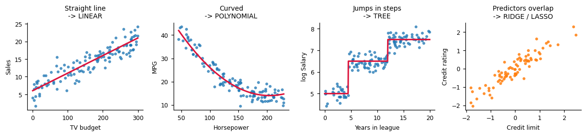
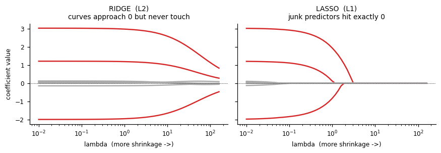
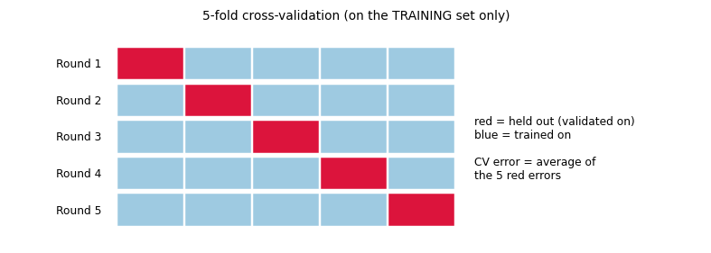
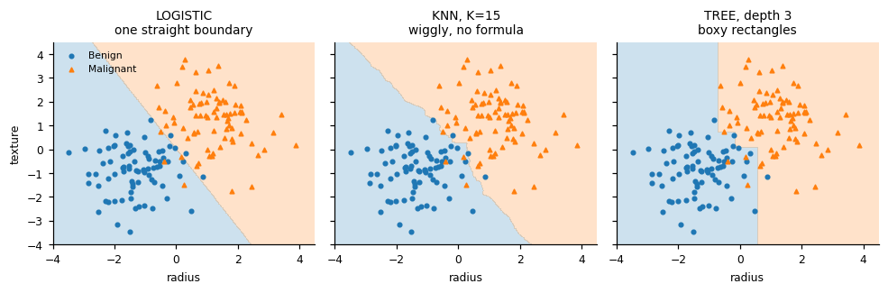
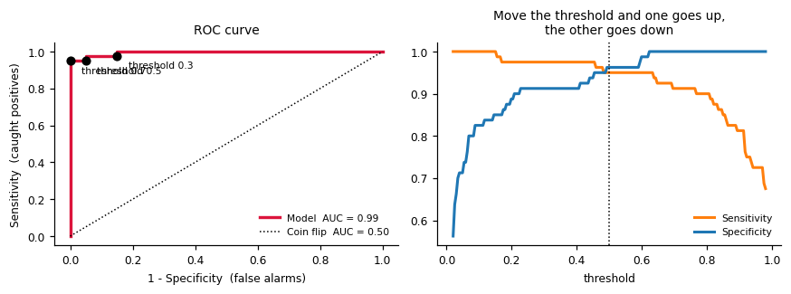
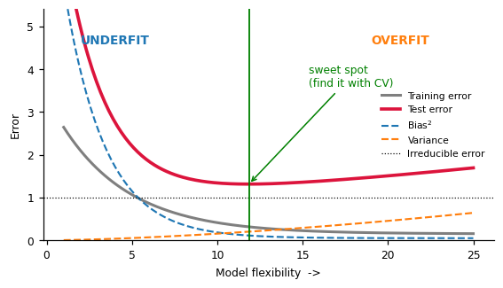

# DSB102 — The whole unit on one page

## The core idea

Machine learning is **predicting**. You assume `Y = f(X) + ε`

- `X` = inputs (features / predictors)
- `Y` = what you want to predict (response / target)
- `f` = the pattern — unknown, the model's job is to guess it
- `ε` = noise you can **never** remove (irreducible error)

| Type               | Y is       | Question     |
| ------------------ | ---------- | ------------ |
| **Regression**     | a number   | _how much?_  |
| **Classification** | a category | _which one?_ |

Everything else is: **which model → how to check it → how to improve it.**

```python
# every snippet below assumes this
import numpy as np, pandas as pd
from sklearn.model_selection import train_test_split, cross_val_score, GridSearchCV
X_train, X_test, y_train, y_test = train_test_split(X, y, test_size=0.2, random_state=42)
```

---

# PART 1 — REGRESSION

You get a table of numbers. Learn the pattern, then predict the missing number.

```
   TV    Radio  Newspaper | Sales
  230.1   37.8     69.2   |  22.1
   44.5   39.3     45.1   |  10.4
   17.2   45.9     69.3   |   9.3
  ------------------------|--------
   50.0   25.0     10.0   |   ???   <- predict this
```

## Step 1: plot it, then pick the model



**Read the shape → read the model name.** That is the whole decision.

---

### 1. Straight line → **Linear regression (OLS)**

Minimises `RSS = Σ(y − ŷ)²`. Start here always.

```python
from sklearn.linear_model import LinearRegression
lr = LinearRegression().fit(X_train, y_train)
print(lr.intercept_, lr.coef_)          # β0 and β1...βp
y_pred = lr.predict(X_test)

# want p-values / t-stats / F-test? use statsmodels instead
import statsmodels.formula.api as smf
m = smf.ols("Sales ~ TV + Radio + Newspaper", data=df).fit()
print(m.summary())                      # coef, std err, t, P>|t|, R²
```

_Interpret:_ β₁ = "if TV goes up 1 unit, Sales goes up β₁ units, **holding the others fixed**."

---

### 2. Curved → **Polynomial regression**

Still linear regression — you just feed it `x²` as an extra column.

```python
from sklearn.preprocessing import PolynomialFeatures
from sklearn.pipeline import make_pipeline
poly = make_pipeline(PolynomialFeatures(degree=2), LinearRegression()).fit(X_train, y_train)

# statsmodels version
smf.ols("mpg ~ horsepower + I(horsepower**2)", data=df).fit()
```

Degree too high = overfit. Choose degree by cross-validation.

---

### 3. Many predictors that overlap → **Ridge** and **Lasso**



Same picture, one difference: **ridge curves flatten toward zero, lasso curves hit zero and stop.** Grey = useless predictors, red = real ones.

|           | Penalty          | Effect                      | Use when                              |
| --------- | ---------------- | --------------------------- | ------------------------------------- |
| **Ridge** | `RSS + λ·Σβ²`    | shrinks all, drops none     | many predictors each contribute a bit |
| **Lasso** | `RSS + λ·Σ\|β\|` | some β become **exactly 0** | only a few predictors truly matter    |

```python
from sklearn.linear_model import RidgeCV, LassoCV
from sklearn.preprocessing import StandardScaler
from sklearn.pipeline import make_pipeline

# StandardScaler is NOT optional — the penalty depends on units
ridge = make_pipeline(StandardScaler(),
                      RidgeCV(alphas=np.logspace(-3, 3, 100), cv=5)).fit(X_train, y_train)
lasso = make_pipeline(StandardScaler(),
                      LassoCV(alphas=np.logspace(-3, 1, 100), cv=5, max_iter=10000)).fit(X_train, y_train)

print("best lambda:", ridge[-1].alpha_)
print("lasso kept:", X.columns[lasso[-1].coef_ != 0].tolist())   # the ones that survived
```

`alpha` in sklearn **is** λ. λ=0 → plain linear. λ→∞ → everything dies.

---

### 4. Jumps in steps → **Regression tree**

Splits the data into boxes and predicts the average inside each box. Catches interactions for free.

```python
from sklearn.tree import DecisionTreeRegressor, plot_tree
tree = DecisionTreeRegressor(max_depth=3, random_state=42).fit(X_train, y_train)

import matplotlib.pyplot as plt
plot_tree(tree, feature_names=X.columns, filled=True); plt.show()

# depth controls overfitting — tune it
gs = GridSearchCV(DecisionTreeRegressor(random_state=42),
                  {"max_depth": range(1, 15)}, cv=5,
                  scoring="neg_mean_squared_error").fit(X_train, y_train)
print(gs.best_params_)
```

---

### 5. Just want accuracy → **Random forest / boosting**

Many trees averaged. Beats everything, explains nothing.

```python
from sklearn.ensemble import RandomForestRegressor, GradientBoostingRegressor
rf = RandomForestRegressor(n_estimators=500, random_state=42).fit(X_train, y_train)
gb = GradientBoostingRegressor(n_estimators=500, learning_rate=0.05,
                               max_depth=3, random_state=42).fit(X_train, y_train)

# which variables mattered
pd.Series(rf.feature_importances_, index=X.columns).sort_values(ascending=False)
```

- **Bagging / random forest** — trees built in parallel on bootstrap samples → cuts **variance**
- **Boosting** — trees built one after another on the previous errors → cuts **bias**, slowly

---

## Step 2: is it any good? (metrics)

| Metric         | Formula            | Read as                                                   |
| -------------- | ------------------ | --------------------------------------------------------- |
| **RSS**        | Σ(y − ŷ)²          | squared error left over                                   |
| **TSS**        | Σ(y − ȳ)²          | error if you just guessed the mean                        |
| **R²**         | 1 − RSS/TSS        | fraction of variation explained; 0 = useless, 1 = perfect |
| **Adj. R²**    | R² penalised for p | comparing models with different numbers of predictors     |
| **MSE / RMSE** | RSS/n, √(RSS/n)    | RMSE is in the same units as Y                            |
| **RSE**        | √(RSS/(n−p−1))     | typical size of one miss                                  |

```python
from sklearn.metrics import mean_squared_error, r2_score, mean_absolute_error
rmse = np.sqrt(mean_squared_error(y_test, y_pred))
r2   = r2_score(y_test, y_pred)

# by hand, so you know where they come from
rss = ((y_test - y_pred)**2).sum()
tss = ((y_test - y_test.mean())**2).sum()
r2  = 1 - rss/tss
```

**Never judge on training error** — it always improves as you add predictors. Judge on test error.

---

## Step 3: test it honestly



One train/validation split gives a different answer depending on which rows landed where. k-fold rotates so every row is used for both. **The test set is never part of this.**

```python
from sklearn.model_selection import KFold
scores = cross_val_score(model, X_train, y_train, cv=5,
                         scoring="neg_mean_squared_error")
print("CV RMSE:", np.sqrt(-scores).mean())      # sklearn returns MSE NEGATED
```

Order of operations: **split → cross-validate on train to tune → refit on full train → score once on test.**

---

## Step 4: improve it

```python
# --- forward stepwise: start empty, keep adding the most useful predictor ---
from sklearn.feature_selection import SequentialFeatureSelector
sfs = SequentialFeatureSelector(LinearRegression(), n_features_to_select=5,
                                direction="forward", cv=5).fit(X_train, y_train)
print(X.columns[sfs.get_support()])

# --- collinearity: are predictors just repeating each other? ---
from statsmodels.stats.outliers_influence import variance_inflation_factor
vif = pd.Series([variance_inflation_factor(X.values, i) for i in range(X.shape[1])],
                index=X.columns)
print(vif)          # VIF > 5-10 means trouble -> drop one, or use ridge

df.corr()           # quick eyeball first
```

---

# PART 2 — CLASSIFICATION

Same table, but the answer is a **label**.

```
  radius  texture  concavity | diagnosis
   17.99   10.38     0.300   | Malignant
   13.54   14.36     0.098   | Benign
  --------------------------|-----------
   15.20   12.10     0.210   |   ???
```

Don't use linear regression here — it predicts values below 0 and above 1, which aren't probabilities.

## The models are just different shaped boundaries



---

### 1. Two classes → **Logistic regression** (the default)

Squashes the line into (0, 1): `log(p / (1−p)) = β₀ + β₁X`

```python
from sklearn.linear_model import LogisticRegression
clf = LogisticRegression(max_iter=1000).fit(X_train, y_train)
proba = clf.predict_proba(X_test)[:, 1]      # P(class = 1)
pred  = clf.predict(X_test)                  # same thing, thresholded at 0.5

np.exp(clf.coef_)     # odds ratios — "each extra unit multiplies the odds by this"
```

Coefficients live on the **log-odds** scale. Exponentiate before you interpret them.

---

### 2. Wiggly boundary, no assumptions → **KNN**

Look at the K nearest points, take a vote. **Scale your features** — distance is meaningless otherwise.

```python
from sklearn.neighbors import KNeighborsClassifier
knn = make_pipeline(StandardScaler(), KNeighborsClassifier(n_neighbors=5)).fit(X_train, y_train)

# choose K by CV on the TRAINING set, never by peeking at the test set
gs = GridSearchCV(make_pipeline(StandardScaler(), KNeighborsClassifier()),
                  {"kneighborsclassifier__n_neighbors": range(1, 31)}, cv=5).fit(X_train, y_train)
```

Small K = wiggly = high variance. Large K = smooth = high bias.

---

### 3. Thousands of features (text) → **Naive Bayes**

```python
from sklearn.naive_bayes import GaussianNB, MultinomialNB
nb = GaussianNB().fit(X_train, y_train)      # continuous features
# MultinomialNB for word counts, BernoulliNB for 0/1 features
```

---

### 4. Want rules you can show someone → **Tree**; want accuracy → **Forest**

```python
from sklearn.tree import DecisionTreeClassifier
from sklearn.ensemble import RandomForestClassifier
dt = DecisionTreeClassifier(max_depth=3, random_state=42).fit(X_train, y_train)
rf = RandomForestClassifier(n_estimators=500, random_state=42).fit(X_train, y_train)
```

Trees split on **Gini** or **entropy**, not accuracy — those two reward purer nodes.

---

## Measuring it: confusion matrix → ROC → AUC

|                | Predicted No       | Predicted Yes        |
| -------------- | ------------------ | -------------------- |
| **Actual No**  | TN                 | **FP** (false alarm) |
| **Actual Yes** | **FN** (missed it) | TP                   |

| Metric                   | Formula     | Use when                                        |
| ------------------------ | ----------- | ----------------------------------------------- |
| Accuracy                 | (TP+TN)/all | classes are balanced                            |
| **Sensitivity / Recall** | TP/(TP+FN)  | missing a positive is expensive (cancer, fraud) |
| **Specificity**          | TN/(TN+FP)  | false alarms are expensive                      |
| **Precision**            | TP/(TP+FP)  | you act on every positive prediction            |

Accuracy alone lies: if 99% of emails are ham, "always predict ham" scores 99%.



The threshold is **your choice**, not the model's. Lower it → catch more positives, get more false alarms. ROC sweeps every threshold at once; AUC is the area under it — one number, 0.5 = coin flip, 1.0 = perfect.

```python
from sklearn.metrics import (confusion_matrix, classification_report,
                             roc_curve, roc_auc_score, RocCurveDisplay)
cm = confusion_matrix(y_test, pred)
tn, fp, fn, tp = cm.ravel()
sensitivity = tp / (tp + fn)
specificity = tn / (tn + fp)
print(classification_report(y_test, pred))

# move the threshold yourself
pred_03 = (proba >= 0.3).astype(int)

# ROC + AUC — always on PROBABILITIES, never on hard 0/1 predictions
auc = roc_auc_score(y_test, proba)
RocCurveDisplay.from_predictions(y_test, proba)
```

---

# PART 3 — The one idea underneath all of it



`Expected test error = Variance + Bias² + Irreducible error`

- **Too simple** (straight line on curvy data) → high bias → **underfit**: bad on train _and_ test
- **Too flexible** (deep tree, K=1, λ=0) → high variance → **overfit**: perfect on train, awful on test
- Training error falls forever. Test error is U-shaped. **You want the bottom of the U.**

Every knob in this unit moves you along that axis:

| Knob                    | Turn it up →             |
| ----------------------- | ------------------------ |
| λ in ridge/lasso        | less flexible            |
| K in KNN                | less flexible            |
| Tree depth              | more flexible            |
| Polynomial degree       | more flexible            |
| Number of predictors    | more flexible            |
| Random forest / bagging | same bias, less variance |

And **cross-validation is how you find the bottom of the U** without ever touching the test set.
